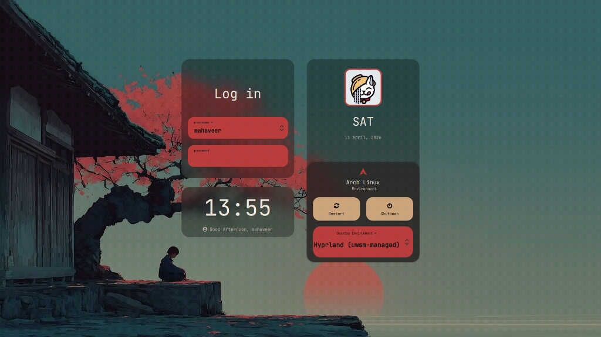

# Ronin SDDM Theme

Ronin SDDM is a stunningly dark, samurai-inspired lock theme for **SDDM (Simple Desktop Display Manager)**. It features dynamic UI capabilities, layered frosted-glass aesthetics, interactive power/session switching, and a polished Demon Slayer color schematic tailored exclusively for modern desktops.



## Features

- **Interactive System Architecture** – Fully decoupled Session/Account dropdowns utilizing global system structures.
- **Deep Glass Optics** – Natively styled frosted-glass UI layers powered by fast-rendering QT5 shaders.
- **Dynamic Clock/Greeting** – Time-aware localized login greetings that actively parse chronological system logic.
- **Thick Typographic Aesthetics** – Tightly locked JetBrains Nerd Font bounding boxes mimicking core Hyprlock setups natively.

## Installation

1. Clone the repository:
   ```sh
   git clone -b ronin https://github.com/mahaveergurjar/sddm.git ronin-sddm
   ```
2. Move the theme to SDDM's theme directory:
   ```sh
   sudo mv ronin-sddm /usr/share/sddm/themes/ronin
   ```
3. Edit the sddm configuration to use the theme:
   ```sh
   sudo nano /etc/sddm.conf
   ```
   Add or modify the following:
   ```ini
   [Theme]
   Current=ronin
   ```
4. Restart sddm:
   ```sh
   sudo systemctl restart sddm
   ```

## Preview

If you want to test the theme without restarting SDDM, run:

```sh
sddm-greeter --test-mode --theme /usr/share/sddm/themes/ronin
```

## Credits

- Custom built for robust Multi-User/Wayland session switching natively.
- Aesthetic styling sourced from modern hyper-dense interface architectures.

---

**Contributions are welcome!** Feel free to fork and improve the theme.
