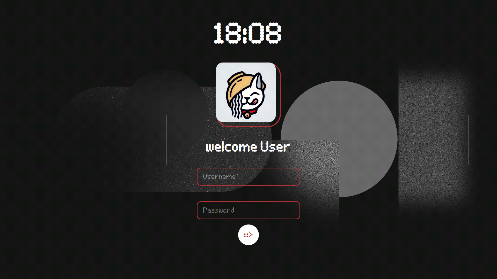

# Nothing UI SDDM Theme

Void UI SDDM is a sleek, minimalist login theme for **SDDM (Simple Desktop Display Manager)**, inspired by **Nothing OS UI**. It features a monochrome aesthetic, dot-matrix elements, and a clean, futuristic design tailored for Hyprland and KDE users.



## Features
- **Minimalist Design** – Inspired by Nothing OS UI.
- **Modular QML Components** – Structured for easy customization.
- **Dark and Light Modes** – Seamless adaptation to different setups.
- **Smooth Animations** – Lightweight yet visually appealing.
- **Custom Font Support** – Uses a dot-matrix-inspired typeface.

## Installation
1. Clone the repository:
   ```sh
   git clone https://github.com/mahaveergurjar/Nothing-SDDM.git
   ```
2. Move the theme to SDDM's theme directory:
   ```sh
   sudo mv Nothing-SDDM /usr/share/sddm/themes/
   ```
3. Edit the SDDM configuration to use the theme:
   ```sh
   sudo nano /etc/sddm.conf.d/10-theme.conf
   ```
   Add or modify the following:
   ```ini
   [Theme]
   Current=Nothing-SDDM
   ```
4. Restart SDDM:
   ```sh
   sudo systemctl restart sddm
   ```

## Configuration
You can further customize Void UI SDDM by modifying the **theme.conf** file:
```sh
sudo nano /usr/share/sddm/themes/Nothing-SDDM/theme.conf
```
Options include font size, animations, layout, and custom branding.

## Preview
If you want to test the theme without restarting SDDM, run:
```sh
sddm-greeter --test-mode --theme /usr/share/sddm/themes/Nothing-SDDM
```

## License
This theme is open-source and licensed under the **MIT License**.

## Credits
- Inspired by **Nothing OS UI**.
- Built for **Hyprland and KDE users**.

---
**Contributions are welcome!** Feel free to fork and improve the theme.
